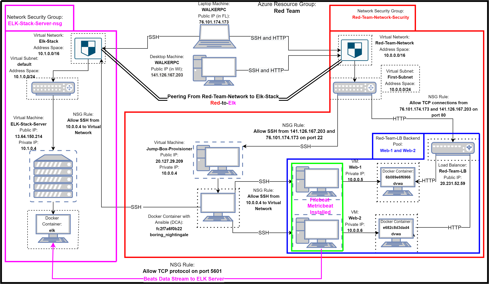

## Automated ELK Stack Deployment

The files in this repository were used to configure the network depicted below.



These files have been tested and used to generate a live ELK deployment on Azure. They can be used to either recreate the entire deployment pictured above. Alternatively, select portions of the _____ file may be used to install only certain pieces of it, such as Filebeat.

  - _TODO: Enter the playbook file._

This document contains the following details:
- Description of the Topology
- Access Policies
- ELK Configuration
  - Beats in Use
  - Machines Being Monitored
- How to Use the Ansible Build


### Description of the Topology

The main purpose of this network is to expose a load-balanced and monitored instance of DVWA, the D*mn Vulnerable Web Application.

Load balancing ensures that the application will be highly resilient, in addition to restricting access to the network.
- _TODO: What aspect of security do load balancers protect? What is the advantage of a jump box?_

Integrating an ELK server allows users to easily monitor the vulnerable VMs for changes to the _____ and system _____.
- _TODO: What does Filebeat watch for?_
- _TODO: What does Metricbeat record?_

The configuration details of each machine may be found below.

```
| Name                 | Function        | Private IP | Public IP     | Operating System | Docker Containers  | Container Function                        |
|----------------------|-----------------|------------|---------------|------------------|--------------------|-------------------------------------------|
| Jump-Box-Provisioner | Gateway         | 10.0.0.4   | 20.127.29.209 | Linux            | boring_nightingale | Ansible, SSH Gateway                      |
| Web-1                | Web Server      | 10.0.0.5   | N/A           | Linux            | dvwa               | Host D*mn Vulnerable Web App              |
| Web-2                | Web Server      | 10.0.0.6   | N/A           | Linux            | dvwa               | Host D*mn Vulnerable Web App              |
| ELK-Stack-Server     | Data Aggregator | 10.1.0.4   | 13.64.150.214 | Linux            | elk                | Host Elastic Search, Logstash, and Kibana |
```

### Access Policies

The machines on the internal network are not exposed to the public Internet. 

Each of the virtual machines can accept connections from the Internet but only under specific circumstances. Access to these machines is only allowed from the following IP addresses:
```
        141.126.167.203
        76.101.174.173
```


Machines within the network can only be accessed directly via SSH by the Jump-Box-Provisioner virtual machine.

A summary of the access policies in place can be found in the table below.

```
| Name                 | Pubicly Accessible | Allowed Source IP Addresses and Ports                         | Allowed Destinations |
|----------------------|--------------------|---------------------------------------------------------------|----------------------|
| Jump-Box-Provisioner | Yes                | 141.126.167.203:22, 76.101.174.173:22                         | Virtual Network      |
| Web-1                | No                 | 10.0.0.4:22, 141.126.167.203:80, 76.101.174.173:80            | Virtual Network      |
| Web-2                | No                 | 10.0.0.4:22, 141.126.167.203:80, 76.101.174.173:80            | Virtual Network      |
| Elk-Stack-Server     | Yes                | 10.0.0.4:22, 141.126.167.203:22,5601 76.101.174.173:22,5601,  | Virtual Network      |
```

### Elk Configuration

Ansible was used to automate configuration of the ELK machine. No configuration was performed manually, which is advantageous because manual configurations can often run into issues where much time is spent configuring software to be used on a particular machine. Ansible avoids this issue by following a consistent, reliable, and simple "playbook", as it is referred to in the application, to setup configurations the same way everytime. In conjunction with Docker, a Platform as a Service (PaaS) software that uses OS-level virtualization in the form of "containers" to deliver software, Ansible playbooks were leveraged in this project to ensure consisent installation of the ELK machine, the D*mn Vulnerable Web Application machines, and the Metricbeat and Filebeat data collection software. 

The [playbook](Ansible/elkplaybook.yml) implements the following tasks:
- Installs Docker service
- Installs python 
- Installs Docker Module
- Increases the VMs vitual memory
- Configures the BM to use it's increased memory
- Downloads an image of an ELK container and launches it
- Ensures that docker is started on boot

The following screenshot displays the result of running `docker ps` after successfully configuring the ELK instance.


### Target Machines & Beats
This ELK server is configured to monitor the following machines:
- _TODO: List the IP addresses of the machines you are monitoring_

We have installed the following Beats on these machines:
- _TODO: Specify which Beats you successfully installed_

These Beats allow us to collect the following information from each machine:
- _TODO: In 1-2 sentences, explain what kind of data each beat collects, and provide 1 example of what you expect to see. E.g., `Winlogbeat` collects Windows logs, which we use to track user logon events, etc._

### Using the Playbook
In order to use the playbook, you will need to have an Ansible control node already configured. Assuming you have such a control node provisioned: 

SSH into the control node and follow the steps below:
- Copy the _____ file to _____.
- Update the _____ file to include...
- Run the playbook, and navigate to ____ to check that the installation worked as expected.

_TODO: Answer the following questions to fill in the blanks:_
- _Which file is the playbook? Where do you copy it?_
- _Which file do you update to make Ansible run the playbook on a specific machine? How do I specify which machine to install the ELK server on versus which to install Filebeat on?_
- _Which URL do you navigate to in order to check that the ELK server is running?

_As a **Bonus**, provide the specific commands the user will need to run to download the playbook, update the files, etc._